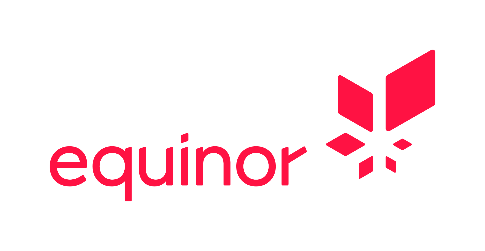

<p align="center">
  <a href="https://www.equinor.com">
    
  </a>
</p>

# EnergyVision

This is the main repository for the [equinor.com website](https://www.equinor.com). This version of the website is built using the [Sanity content platform](https://www.sanity.io/) as headless CMS and [Next.js](https://nextjs.org/) for the web frontend.

The project is licensed under the [MIT license](https://github.com/equinor/energyvision/blob/main/LICENSE) following [the open source strategy of Equinor](https://opensource.equinor.com) and integrates elements from the [Equinor Design System](https://eds.equinor.com).

## Getting started

This project uses [pnpm](https://pnpm.io) as main package manager. You can install pnpm using npm as shown below, or use one of the [alternative installation methods](https://pnpm.io/installation).

```bash
# Install pnpm
npm i -g pnpm

# Install all project dependencies
pnpm setup-project
```

For compatibility reasons, the Sanity Studio uses the Yarn package manager, and the search indexer uses npm. The `pnpm setup-project` script will automatically install the dependencies for the Studio as well as the workspace packages listed in `pnpm-workspace.yaml`. See the [section on package managers](#package-managers) for more information.

This project requires several environment variables to run. These environment variables should be added in `studio/.env.development`, `web/.env.local`, and `search/.env` respectively.

## Project overview

This monorepo is organized into several folder. Please refer to README files inside each folder for more information.

- `studio` - [Sanity](https://www.sanity.io/) powered content platform.
- `web` - Web application using [Next.js](https://nextjs.org/) and React components.
- `search` - Azure functions for maintaining search indexes at [Algolia](https://www.algolia.com/apps/24ZMKUY18Z/dashboard).
- `legacy` - Archived code/content from previous versions of the equinor.com website.

## Package managers

This project uses the pnpm package manager. All commands should be run from root. There are filter aliases in the root `package.json` file that can be used to run commands in specific directories. For example:

```bash
# Install dependencies
pnpm web install

# Start the web in dev mode
pnpm web dev

# Add some package to the web folder
pnpm web add <some-package>

# Build Next.js
pnpm web build
```

If you need to add arguments to scripts when using one of the aliases, such as `--force` or `--dev` to force a re-install of all dependencies, you must add `--` when running these commands from the project root. For example:

```bash
# Add a dev-dependency
pnpm web add chalk -- --save-dev
```

### Studio

Since version 2 of the Sanity Studio does not work well with pnpm (and defaults to Yarn when deploying), we use Yarn as package manager inside that folder instead. You can still run command from root using pnpm using the `studio` alias, but adding/updating/removing packages from the root may work unexpectedly.

```bash
# Start studio in dev mode
pnpm studio dev
```

### Search

Due to compatibility issues, npm is used for the Search Indexers. The reason being that it was not possible (with pnpm v6 at least) to generate a package containing all dependencies from the search folder. So in order to work with dependencies for anything under `search`, use npm from within that folder. You can still use pnpm from the root folder to execute scripts however.

## Legacy packages

The `legacy` folder contains packages related to static content from the AEM based equinor.com website and the legacy CSS/JavaScript needed to run this static content. These packages are rarely updated and rely on outdated and/or deprecated dependencies. This causes issues when using a node version higher than node v14 on certain platforms (for example node-sass does not compile). When working on these packages, be sure to switch to node v14 to build the packages.

The legacy packages are currently excluded from the pnpm workspace (see `pnpm-workspace.yaml`) so will not have their dependencies installed when running `pnpm setup-project` / `pnpm m i` / `pnpm recursive install` from the project root.

## Feature flags

We use a trunk-based development approach in this project, where developers commit directly to the main branch and deployments are done regularly. To help accomodate the review/acceptance process, we use feature flags that will conditionally enable/disable certain functionality. These feature flags are based on the currently active [Sanity dataset](https://www.sanity.io/docs/datasets). This allows us to have features that are not yet ready for production enabled in the development dataset, while being disabled in the production dataset.
