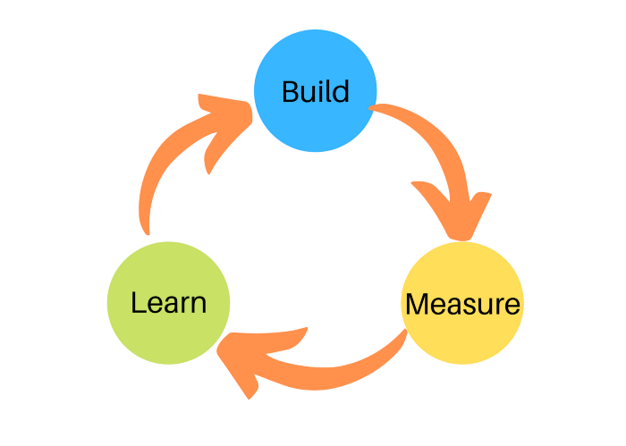

# How we use Kanban as our preferred agile framework

## Principles
1. **Start with what you do now** - Kanban does not dictate setup or procedure. You can start with what you have.
1. **Agree to pursue incrementar, evolutionary change**
1. **Respect the current process, roles, responsibilities & titles**
1. **Encourage acts of leadership at all levels**

## How to succeed with Kanban
1. **Visualize the workflow**
    * Kanban board
    * Classes of Service
1. **Limit Work In Progress, WIP**
1. **Manage flow**
    * Strive for progess
1. **Make Process Policies Explicit**
    * Understand problem at hand
    * *Definition of done*
1. **Improve Collaboratively** (using models & the scientific method)

## Lean principles
\
 
* VALUE - "Everything a customer is willing to pay for"
    * Main motivation is to give value to the customer
    * Focus on business case
    * Understand the customer
* FLOW
    * Maintain the flow
    * Do not stop!
 
 
 
 
 
 

## Roles
### Service Delivery Manager (SDM)
* A bit similar to SCRUM Master, but not quite
* Make sure flow is maintained
* Facilitate improvement activities

### Product Owner (PO) or Service Request Manager
* Ensure customer needs are taken care of
* Manage risk

## Tools
* Priority meetings / backlog grooming
* Standups
* Retrospectives
* *Information Radiators* - dashboard with current project status
* Release planning
* Continous Integration

## The Kanban board
We have four categories of issues in this project:
* Epic
* User Story
* Task
* Bug

### Epic
* An Epic is a big piece of the systm/application. It could be a feature, a business need or similar that everyone in the project can relate to.
* The number of epics within a project should be limited. Somewhere between 10-30 is common.
* Epics are not testable. They should be broken down into User Stories that can be testet.
* Epics are typically created by the PO together with the customer.
Ex:\
*As a customer I would like to have access to the system through my phone*

### User Story (US)
A user story is a part of a delivery that gives business value. It should be able to express it in a concrete manner and it must be able to test it. A user story always exists in context of an epic.
\
\
User stories are expressed like this:\
*As a [type of user]\
I would like to [reach a goal]\
so that [business value is gained]*\
\
Example:\
*As a user of a mobile app I would like to be able to filter on tasks so that I can save valuable time*

User stories may be split further into Tasks when necessary

### Task
A task on it's own does not give business value, but it is necessary in order to reach a larger goal. Tasks can be connected to a User Story, or they can exist on their own.\
\
Example:\
*As a web-api I would like access to more CPU power in order to shrink the response time to less than 50ms for service x*

### Bug
Bugs are unitentional and something that represents a problem in the system.
They are added to the board if found during testing, staging or in production. If a developer identifies a problem with the task at hand, this is not considered a bug and should be fixed as part of the initial task.\
Bugs should be associated with a User Story. That makes it easier to reason about them and track the cause of the issue.
It is important that a Bug is written in such a manner that it is easily testable; use acceptance criterias.\
Put bugs on top of the board so that it screams "Pick me!". We don't want many open bugs in the system!

### Using the board
[To be decided once the board is alive]

## Classes of service
In Kanban there is the concept of "classes of service" that tells us something about how a task is classified. You can define whichever classes you like, but a good strategy is to keep it simple. A typical example is to use three classes:
1. Blocker – something that is blocking us and must be solved asap. Trumps WIP.
1. Critical – critical task (in most cases a bug) that should be prioritized, but not at the cost of the task you are working on.
1. Major – a regular task (or issue in Zenhub). All tasks should default to the same class when added to the board.